# CronMan 分布式任务调度系统

<div align=center></div>

## 简介

CronMan是一款轻量级的分布式任务调度系统。随着微服务化架构的逐步演进，单体架构逐渐演变为分布式、微服务架构，相应的也需要一个分布式任务调度系统来管理分布式架构中的定时任务。

已有的分布式任务调度系统如：Saturn、elastic-job、xxl-job都是非常优秀的开源作品，为了学习与交流，我设计了一款轻量级的分布式任务调度系统CronMan，具有一些崭新的特性如：**任务编排**、**容灾处理**、**高可用**、**任务幂等性触发**等，弥补了上述开源系统的部分缺点。

## 内容一览

- [功能](#功能)

- [系统架构](#系统架构)
  * [整体架构](#整体架构)
  * [应用场景](#应用场景)
  * [设计思想](#设计思想)
- [效果一览](#效果一览)
  * [任务配置](#任务配置)
  * [任务监控](#任务监控)
  * [任务依赖](#任务依赖)
- [实践和使用](#实践和使用)
  * [使用流程](#使用流程)
  * [示例](#示例)
- [TODO](#TODO)

## 功能

- **定时任务**：调度系统最基础的功能，定时完成用户提出的任务，可实现**秒级任务**调度。

- **任务监控**：监控任务运行的状态：已就绪，禁用，执行中等。

- **任务控制**：注册、启用、禁用、删除任务。

- **任务分片**：对于一个大型任务，可以将任务分片置于不同执行器上执行。

- **弹性扩容、缩容**：执行器可以水平扩展 ，同时某个执行器宕机/新增执行器对当前任务的执行无影响。

- **任务重触发**：自动记录错过未触发的任务，重新触发。

- **失效转移**：某台执行器宕机后，归属于该执行器的任务会被重新分发到另外一台执行器上。

- **任务编排**：用户可以编排任务依赖顺序，任务形成一个有向无环图，按照图的顺序依次调用，满足**串行，并行，多依赖**需求。

- **高可用**：调度系统以集群形式部署，当其中一台调度器宕机后，不会影响整体系统的运行。

- **任务幂等性**：精密控制任务的执行次数，用容灾处理来避免任务重复执行。

  


## 系统架构

### 整体架构

<div align=center>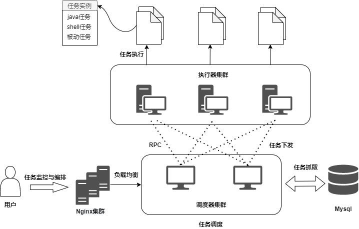</div>


<div align=center>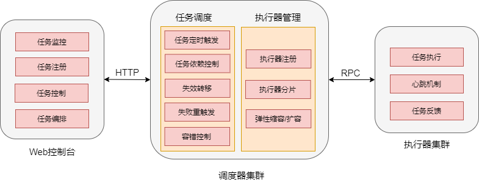</div>


CronMan 可以分为三大模块（调度器集群、控制中心和执行器集群）、两大组件（路由转发组件和持久化存储组件）。这三大模块和两大组件的作用如下：

- 任务调度器集群：负责调度任务，处理控制中心下发的请求等。
- 任务控制中心：负责任务的注册、启用、禁用、删除注册等，对任务进行逻辑编排，提供实时监控功能。
- 任务执行器集群：负责接收调度器下发的任务请求，并执行任务逻辑。
- 路由转发组件（Nginx）：实现调度集群的高可用（如果对高可用不需要，那就可以不使用）。
- 持久化存储（DB）：记录任务的具体细节、已执行情况等。

<div align=center>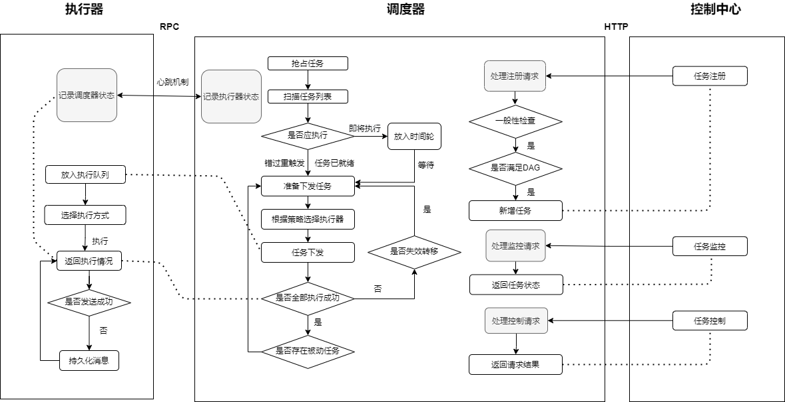</div>


### 应用场景

**举例：**

- 场景
  1. 每天凌晨1点跑单查hive，进行每日清算。

  2. 用户下单后长时间未支付，需要修改订单状态。

  3. 电商整点抢购，商品价格0点整开始优惠。  

  4. 发放优惠券、发送短信提醒等。


- 解决

  通过分布式系统来调度任务，最主要的功能就是将任务分解为**子分片**，每个分片绑定一台机器处理对应的任务。

  对一般场景而言，一个任务可能由**多个操作**组合而成，而将这些操作**分解**依次派发给子分片来完成。

      比如`` 发送短信``的任务，需要发送三千万条生日祝福短信，使用十个分片。每个分片只需要发送三百万条短信。
      就极大缓解了机器的压力。
      
      比如`` 发放生日优惠券``的任务，需要先查用户信息库，获取需要派发优惠券的用户信息，再操作用户卡券库，
      检验是否优惠券已存在、增添优惠券等流程，就可以用不同分片来处理不同操作。

  对复杂场景而言，如果存在分库分表的情况下，可以对任务继续细分。

      比如`` 发放生日优惠券``的任务，需要先查用户信息库，获取需要派发优惠券的用户信息。
      这时候可以选择让一台分片机器专门负责查询用户信息，一台分片机器专门查询用户卡券信息，
      避免了多台机器对同一数据库资源的竞争。


- 一般场景

<div align=center>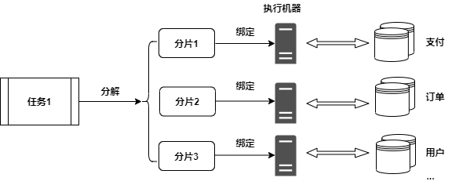</div>


- 复杂场景

<div align=center>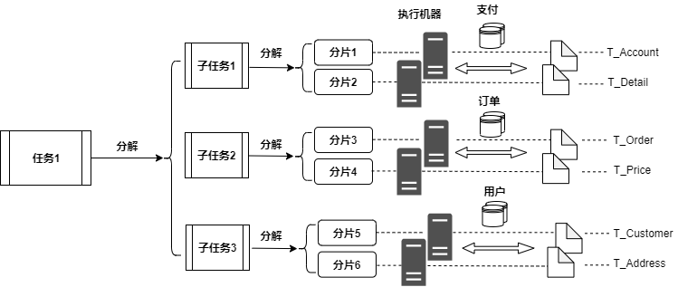</div>


### 设计思想

#### 服务发现/注册

作为**分布式**的系统，最先需要考虑的问题自然是**服务发现/注册**。主流的两种做法分别是：1.以elastic-job为代表的**无中心化**解决方案，通过引入Zookeeper来实现分布式协调。优点很明显，缺点则是无法实现高可用（zk本身的缺点），并且系统复杂度提高了很多。2.以xxl-job为代表的**中心化**解决方案，调度中心通过DB锁保证集群分布式调度的一致性。

我的理解是：分布式任务调度系统主要的目的是缓解大型定时任务（如在某个时间点发送千万张优惠券）对单台机器的压力，将**任务分散到多台机器**上，偏向于**分布式处理数据**，所以调度器本身不参与数据处理，只是单纯地下发任务、发送请求等，没必要引入第三方组件。

同时，受RocketMQ中**NameServer**设计的启发，我认为调度器本身和NameServer是非常类似的：1.NameServer节点之间**互不通信**，调度器也不需要互相通信 2.NameServer**本身不参与**业务处理，调度器也不需要 3.Producer和Consumer只需要和**随机一个**NameServer建立连接即可，而用户发送的请求也只需要一个调度器来响应处理即可。 4.NameServer的主要功能是为Client提供**路由能力**（简单来说就是找到一个活着的节点），而调度器的功能也是为任务找到活着的执行器，下放给它执行。

所以我参考了NameServer的模式，使执行器与调度器集群的**每一个节点**建立长连接，通过心跳机制定时注册信息到所有的调度器来向调度器证明自身还存活。在路由注册操作中引入了ReadWriteLock**读写锁**，允许多个任务控制器并发读，保证了任务发送时的高并发。同一时刻调度器只能处理一个执行器的心跳包，多个心跳包串行处理。


#### 一致性与任务幂等性

关于**一致性与任务幂等性**，系统需要保证``请求``与``任务``不能**重复触发**。这里涉及到多种可能的情况：


- 用户在Web端发送的``请求``只能有一个调度器来处理

- ``某个发送任务`` 同一时刻只能由一个调度器触发。

- 某台执行器与调度器连接断开，但是它并没有宕机，任务还在执行，而调度器在长时间没有接收到它的心跳包后认定它断联，根据**失效转移**策略，任务又会被发送到另外一台执行器上执行。

- 某台执行器完成了任务，通知执行器``任务已完成``的消息刚发送给某台调度器，这台调度器就宕机了。而其他调度器根据**失效转移**策略，任务又会被发送到另外一台执行器上执行。

- 某台调度器对数据库的多次操作是否会冲突？比如mapper.selectAll()后进行mapper.update()，在这两步中间另外一个线程也mapper.select()，这时此线程读到的就是旧数据。


处理情况一：用户通过Web端发送了任务监控与编排请求，通过Nginx来控制请求只发送到一台调度器上。

处理情况二：调度中心通过竞争DB排他锁来保证，某个任务同一时刻只能由一个调度器拿到，并且调度器会修改任务的状态，从而确保另外的调度器无法拿到这个任务，避免了任务的重复执行。

处理情况三：执行器与调度器断开后，会立即中断自身所有的执行任务。

处理情况四：执行器发送完``任务已完成``的消息后，会等待调度器的响应，如果超时或者错误，就会将``任务已完成``的消息持久化到本地，定时扫描消息，直到``任务已完成``的消息被调度器接受。

处理情况五：为保证数据库的一致性，普通的方法是开启事务保持ACID，本系统为了提供秒级的任务调度，使用读写锁来控制并发问题，在JVM层面提供并发控制而不是丢给数据库处理，尽可能减小时间开销。


## 效果一览

### 任务配置

任务在这里进行注册，根据**任务类型**来配置不同的任务。目前共有四种任务，**定时**任务需要配置Cron表达式，到达对应时间，任务就会触发；**被动**任务不需要配置Cron表达式，上游任务全部完成后，被动任务自动开始触发；**Java**任务是普通Java程序的任务，需要配置类名、方法名、参数类型以及参数；**Shell**任务则是shell脚本任务，需要配置脚本内容，也可以稍后在监控页面配置。

<div align=center>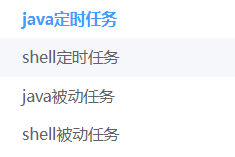</div>


<br>
根据每个任务不同的需求，相应地配置不同的分片数、是否允许失效转移、是否允许错过任务重触发、选择执行器的策略等。
<br>

<div >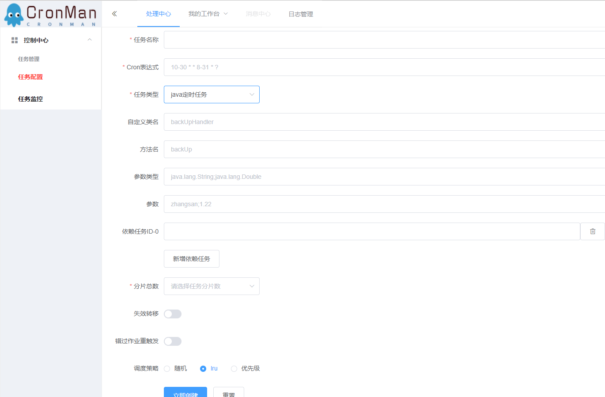</div>

<br>

<div>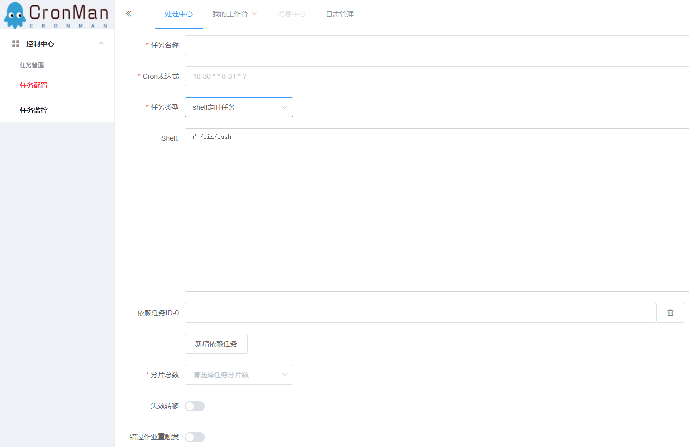</div>

可通过依赖任务来配置依赖的上游任务，构成一个DAG图。任务以DAG图的形式执行，只有当上游任务都完成时，下游任务才能开始。
<br>
<br>

<div align=center>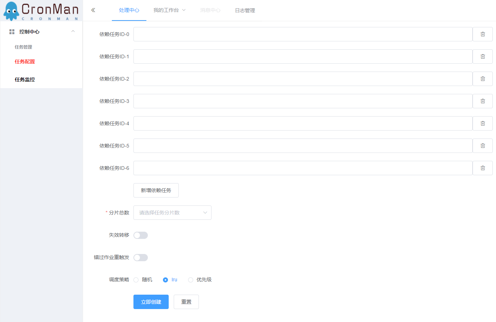</div>

<br>
<br>


### 任务监控

监控任务的状态，共分为：**已就绪、执行中、等待上游任务、已停用**四种状态。其中，已就绪代表任务就绪，只需等待设定时间一到/上游任务完成即可开始执行；执行中代表任务已交由执行器执行；等待上游任务为被动任务特有，代表上游任务一执行完就可以立马执行；已停用代表任务暂时停止执行。

控制任务的执行，**启用、禁用、删除**任务。

查看任务的**DAG依赖图**，包括上游和下游的所有关联任务。

<div align=center>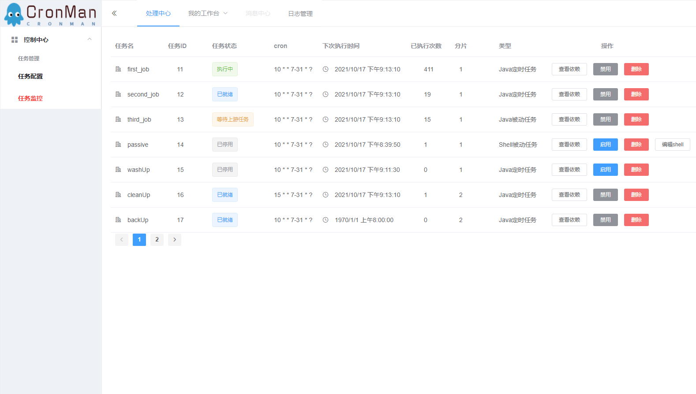</div>


对**shell任务**，可以通过控制中心在线修改任务的具体内容。

<div align=center>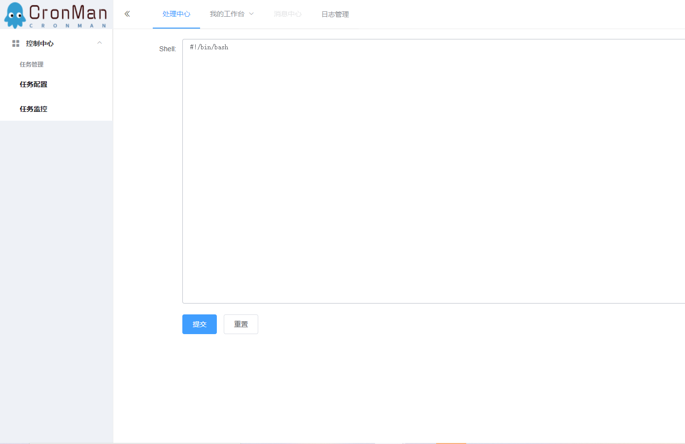</div>


### 任务依赖

针对某项任务，可以查看它的**关联DAG图**，实时查看各项任务的状态。

点击 backUp 的``查看依赖``，就可以看见 backUp 的DAG任务依赖图。可以看出backUp和多个任务相互有关联，它的下游任务是cleanUp。backUp的状态为已就绪，待设定时间到就会开始执行，而cleanUp在backUp完成之后，还需要等待它的上游任务washUp完成才能开始执行。

<div align=center>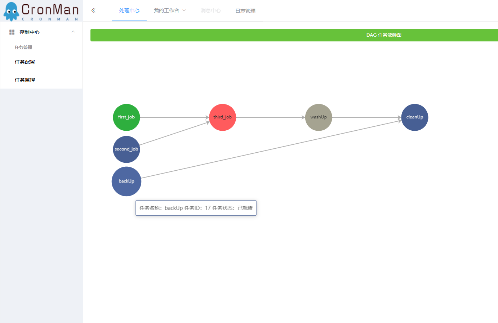</div>


点击 passive``查看依赖``，就可以看见 passive的DAG任务依赖图。因为passive任务和其他任务没有依赖关系，所以DAG图只有它自己，当前的状态为已停用。

<div align=center>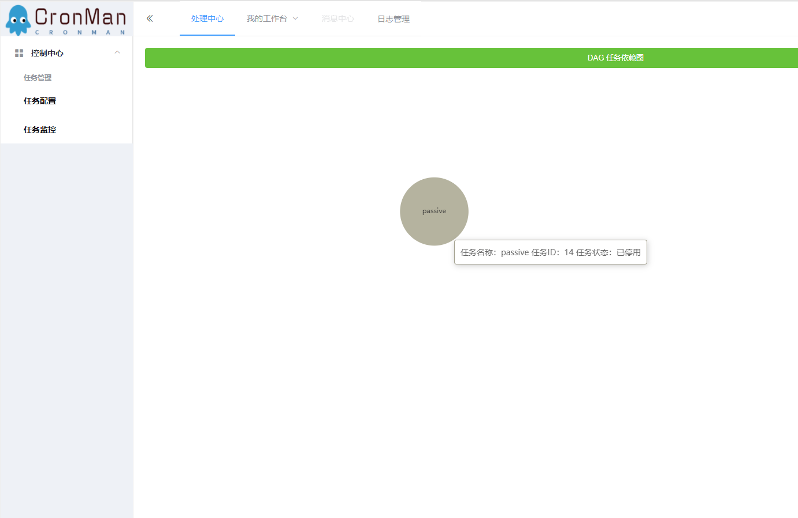</div>


## 实践和使用

CronMan是SpringBoot项目，使用者暂时也需要用SpringBoot来使用执行器。（因为楼主要写论文，所以没有太多空闲时间用来适配各种其他的项目）

### 使用流程

```
1. 下载项目 & 打包执行器(executor)模块

2. 配置数据库

3. 将1.中打好的包作为依赖引入你自己的项目中

4. 为你的任务添加上@scheduleJob注解，并在数据库/控制台添加上这个定时任务
```


### 示例

**设定任务：**

添加定时任务，每分钟备份一次数据库demo和demo2，每个数据库中各有一百万条记录，将sql存储到磁盘中。设置两个分片来完成这个任务。

1. 首先下载整个项目。
    
    ```
    git clone git@github.com:smmdwa/CronMan.git
    ```

2. 使用assembly:assembly 的maven插件可以快速进行打包（PS：这里不要用SpringBoot的打包插件，因为Spring Boot 中默认打包成的 jar 是 ``可执行`` jar，无法被依赖）

3. 利用项目中的sql/cronjob.sql 配置数据库

4. 配置调度器的application.yml

   ```
   spring:
     datasource:
       driver-class-name: com.mysql.cj.jdbc.Driver
       url: jdbc:mysql://192.168.213.130:3306/cronjob?characterEncoding=utf-8&useSSL=false&useAffectedRows=true
       username: root
       password: 123456
   server:
     port: 8081
   
   #netty监听端口
   remoting:
     address: 127.0.0.1:8088
     
   #mybatis的相关配置
   mybatis:
     mapper-locations: classpath:mapper/*.xml
     type-aliases-package: com.distribute.remoting.bean
     configuration:
       map-underscore-to-camel-case: true
   ```

5. 新建一个SpringBoot项目demo，这里采用的是本地依赖，新建lib目录，放入2.中打好的jar包，引入依赖。

    ```
            <dependency>
                <groupId>com.distribute</groupId>
                <artifactId>executor</artifactId>
                <version>0.0.1</version>
                <scope>system</scope>
                <systemPath>${project.basedir}/lib/executor-0.0.1-SNAPSHOT.jar</systemPath>
            </dependency>
    ```

6. 注入bean

    ```
    @Configuration
    @ComponentScan(basePackages = {"com.distribute"})
    public class CronConfig {
    }
    ```

7. 编写备份任务

    <div align=center>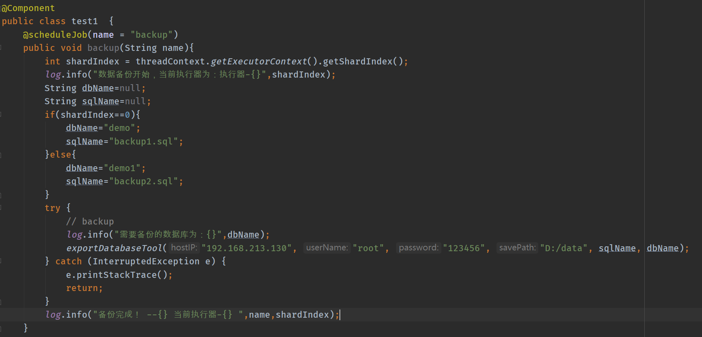</div>

8. 配置demo项目的application.yml

    ```
    executor:
      name: executor-1
      ip: 127.0.0.1
      port: 8092
    remoting:
      address: 127.0.0.1:8088;127.0.0.1:8089
    server:
      port: 8092
    controller:
      channel:
        expiredTime: 30000
    ```

9. 启动一台调度器和两台执行器（记得修改port和remoting.address）
10. 成功！

    <div align=center>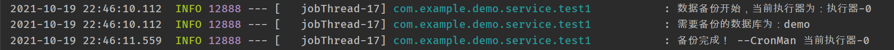</div>

    <div align=center>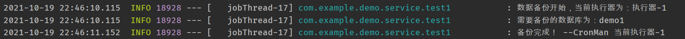</div>


## TODO

1. 日志管理

2. 支持多语言定时任务 python等


